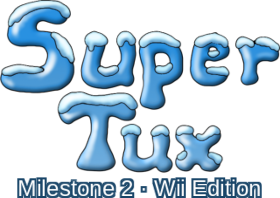

<p align="center">
  
</p>

<br><br>

## Wii port of the free open source game SuperTux (Milestone 2)

```text
Ported by: DeltaResero
Type: Platform game
Version: 0.5.1-wii-d.00
Software license: GPLv3+
```

[![Latest Release][release-img]][release-url]
[![View All Releases][downloads-img]][downloads-url]
[](LICENSE)

<!-- Link Definitions -->
[release-img]: https://img.shields.io/github/v/release/DeltaResero/SuperTux2-Wii?label=Latest%20Release
[release-url]: https://github.com/DeltaResero/SuperTux2-Wii/releases/latest
[downloads-img]: https://img.shields.io/badge/Downloads-View_All_Releases-blue
[downloads-url]: https://github.com/DeltaResero/SuperTux2-Wii/releases

<br>

## About Repository

This is a Wii port of SuperTux Milestone 2, forked from the 0.5.1 release of
[upstream SuperTux](https://github.com/SuperTux/supertux). It's designed for use through the
[Homebrew Channel](http://wiibrew.org/wiki/Homebrew_Channel) with
[OpenGL (via OpenGX)](https://github.com/devkitPro/opengx) support, but it will alternatively
still run on other platforms such as Linux, though Mac support has been dropped from this fork.

The port isn't just a patch set on top of upstream. Rendering, audio, and the scripting engine have
all been reworked to run on machines with limited memory and no shaders. Backgrounds larger than
the hardware accepts (1024 pixels on the Wii) are cut into pieces that fit. Squirrel and
simplesquirrel are vendored into the tree rather than fetched, localization has been removed,
and the video path draws through [SDL2 for Wii](https://github.com/devkitPro/SDL) on either the OpenGL or the SDL renderer.

A Wii port of SuperTux Classic (Milestone 1) is maintained separately at
[SuperTux-Wii](https://github.com/DeltaResero/SuperTux-Wii). For more information about
SuperTux itself, please visit the official website at
[supertux.org](https://www.supertux.org).

<br>

## About SuperTux

SuperTux is a jump'n'run game with strong inspiration from the Super Mario Bros. games for
various Nintendo platforms.

Run and jump through multiple worlds, fighting off enemies by jumping on them, bumping them
from below, or tossing objects at them, while grabbing power-ups and other collectibles along
the way.

This release brings over 150 levels across 7 worlds.

<br>

## Playing the Game

The Wii Remote (alone or with a Nunchuk), Classic Controller, GameCube Controller, and a USB
keyboard are all supported. Bindings can be viewed/changed from **Options > Setup Joystick**, or
**Setup Keyboard**.

The only controls needed in-game are move, jump, duck, and action. "Action" picks up objects
and uses whatever powerup Tux is carrying. The fire flower shoots fireballs and the ice
flower fires ice pellets. On the worldmap, move to travel between levels and use the jump key to
select the one Tux is standing on. During gameplay, use the pause key to access the pause menu.

| Action            | Wii Remote (sideways) | Wii Remote + Nunchuk | Classic Controller         | GameCube Controller    | Keyboard               |
|-------------------|-----------------------|----------------------|----------------------------|------------------------|------------------------|
| Move / Duck       | `D-pad`               | `Stick` or `D-pad`   | `Left Stick` or `D-pad`    | `Stick` or `D-pad`     | `Arrow Keys`           |
| Jump              | `2` or `A`            | `A` or `2`           | `A` or `Y`                 | `A` or `Y`             | `Space`                |
| Action            | `1` or `B`            | `B`, `C` or `1`      | `B` or `X`                 | `B` or `X`             | `Ctrl` or `Alt`        |
| Look Left / Right | `-` / `+`             | `-` / `+`            | `L` / `R` or `Right Stick` | `L` / `R` or `C-Stick` | `Delete` / `Page Down` |
| Look Up / Down    | Hold up / down        | Hold up / down       | Hold up / down             | Hold up / down         | `Home` / `End`         |
| Pause             | `HOME`                | `HOME` or `Z`        | `HOME`                     | `START` or `Z`         | `Esc` or `P`           |

To look up or down on a pad, stand still and hold up or down for 2 seconds. The Classic
Controller's `-` and `+` look left and right as well.

<br>

## Setup Guide for devkitPro PowerPC Build System

To set up the devkitPro devkitPPC PowerPC build system, follow the instructions on the official
devkitPro wiki:

- [Getting Started with devkitPro](https://devkitpro.org/wiki/Getting_Started)
- [devkitPro Pacman](https://devkitpro.org/wiki/devkitPro_pacman)

After setting up devkitPPC including environment variables, use (dkp-)pacman to install the
following dependencies:

**Build Tools (Required):**
```
devkitPPC (C++23 compatible compiler)
gamecube-tools (provides elf2dol)
wii-cmake
wii-pkg-config
```

**Core Libraries (Required):**
```
libogc
libfat-ogc
wii-sdl2
wii-sdl2_image
```

**Audio (Required):**
```
wii-sdl2_mixer
ppc-libvorbis
ppc-libogg
```

**Graphics & Compression:**
```
ppc-libpng
ppc-libjpeg-turbo
ppc-zlib
```

**OpenGL/OpenGX Backend (Optional but Recommended):**
```
wii-opengx
```

<br>

## Build Configuration

You can configure the build by passing flags to `cmake`. For example, to build without OpenGL
support, append the following flag to your `cmake` command: `-DENABLE_OPENGL=OFF`

| Option                  | Description                                            | Default PC | Default Wii    |
|-------------------------|--------------------------------------------------------|------------|----------------|
| `CMAKE_BUILD_TYPE`      | Build type (Debug or Release)                          | `Release`  | `Release`      |
| `ENABLE_OPENGL`         | Build the OpenGL renderer alongside the SDL one        | `ON`       | `ON` (OpenGX)  |
| `ENABLE_GLEW`           | Load OpenGL extensions through GLEW                    | `ON`       | `OFF`          |
| `ENABLE_NPOT_TEXTURES`  | Assume the hardware accepts any texture size           | `OFF`      | `ON`           |
| `TEXTURE_ALIGNMENT`     | Round texture sides up to a multiple of this many px   | `1`        | `4`            |
| `ENABLE_LIGHTMAP_FBO`   | Draw the lightmap into its texture with a framebuffer  | `OFF`      | `ON`           |
| `ENABLE_OPENAL`         | Build the OpenAL sound backend                         | `ON`       | `OFF`          |
| `ENABLE_SDL_MIXER`      | Build the SDL_mixer sound backend                      | `OFF`      | `ON`           |
| `ENABLE_CONSOLE`        | Build the interactive console                          | `OFF`      | `OFF`          |
| `ENABLE_CCACHE`         | Compile through ccache                                 | `OFF`      | `OFF`          |
| `BUILD_TESTS`           | Build test cases                                       | `OFF`      | `OFF`          |
| `BUILD_TESTS_M32`       | Also run the squirrel samples at 32-bit integer width  | `OFF`      | `OFF`          |
| `WARNINGS`              | Enable a long list of compiler warnings                | `OFF`      | `OFF`          |
| `WERROR`                | Stop on the first compiler warning                     | `OFF`      | `OFF`          |

To override, use `-D` followed by any command option and then `=` and then the value.

<br>

## How to Build: Wii Homebrew Build

1. Fetch the one remaining submodule, sexp-cpp:
   ```bash
   git submodule update --init --recursive
   ```

2. Create a build directory:
   ```bash
   mkdir build
   cd build
   ```

3. Configure using CMake and the included Wii Toolchain file:
   ```bash
   cmake -DCMAKE_TOOLCHAIN_FILE=../cmake/toolchains/Wii.cmake ..
   ```
   The system-wide toolchain provided by devkitPro will configure and build, but it does not
   set the console's defaults, so each of them has to be passed by hand.

4. Build the game:
   ```bash
   make -j$(nproc)
   ```

   This produces `boot.dol` in the build directory.

<br>

## Installing SuperTux on Wii (Homebrew Channel)

1. Create a `supertux2-wii` folder under `apps/` on your SD or USB device.

2. Copy in the built `boot.dol`, the `data` folder from the source tree, and the icon and
   metadata from `packaging/wii/`:
   ```
   SD:/apps/supertux2-wii/boot.dol
   SD:/apps/supertux2-wii/data/
   SD:/apps/supertux2-wii/icon.png
   SD:/apps/supertux2-wii/meta.xml
   ```

3. Launch SuperTux from the Homebrew Channel. The game will create a config file and save
   folder on the first run.

<br>

## How to Build: Desktop Linux (Testing/Unsupported)

1. Install Dependencies:
   You will need the following build tools. For the libraries listed below, ensure you install
   the **development headers** (often ending in `-dev` or `-devel`).

   **Build Tools:**
   ```
   A C++23 capable compiler
   CMake 3.16+
   ```

   **SDL 2 Framework:**
   ```
   SDL2 (or sdl2-compat)
   SDL2_image
   SDL2_mixer (only with -DENABLE_SDL_MIXER=ON)
   ```

   **Core Libraries:**
   ```
   libogg
   libvorbis
   OpenAL (or turn it off and use SDL_mixer)
   ```

   **Graphics (Optional):**
   ```
   OpenGL
   GLEW
   ```

2. Fetch the submodule and create a build directory:
   ```bash
   git submodule update --init --recursive
   mkdir build
   cd build
   ```

3. Configure for desktop:
   ```bash
   cmake ..
   ```

4. Build:
   ```bash
   make -j$(nproc)
   ```

5. Run it from where it was built:
   ```bash
   ./supertux2-wii
   ```

   The game finds its own data folder and does not need installing. Options are reachable from
   the menu, and `./supertux2-wii --help` lists what can be passed on the command line for the
   handful of things the menu does not cover.

**Important Note on Installation:**
While `sudo make install` is supported by CMake, it's **not recommended**. Installing files
directly to your system directories this way without using a package manager makes them very
difficult to cleanly uninstall later. We strongly recommend running it from the build directory.

**Note on Other Operating Systems:**
Support for other platforms (Windows, macOS, BSD) is currently outside the scope of this
repository, as the primary focus is the Wii hardware. Given the standard CMake infrastructure,
adapting the build system for other platforms should be fairly trivial.

<br>

## License

This program is distributed under the terms of the GNU General Public License version 3
(or later). You can redistribute it and/or modify it under the terms of the GNU General Public
License as published by the Free Software Foundation, either version 3 of the License, or
(at your option) any later version.

Most of the `data` subdirectory is licensed under CC-by-SA instead. Credits for everyone who
contributed to SuperTux are in `data/credits.txt`, and can be read from the game menu as well.

Please see the [LICENSE](LICENSE) file for the full text.

## Disclaimer

This is an unofficial port of SuperTux that runs on the Wii via the Homebrew Channel. It is not
affiliated with, endorsed by, nor sponsored by the creators of the Wii console nor the Homebrew
Channel. All trademarks and copyrights are the property of their respective owners.

This project is distributed in the hope that it will be useful, but **WITHOUT ANY WARRANTY**;
without even the implied warranty of **MERCHANTABILITY** or **FITNESS FOR A PARTICULAR PURPOSE**.
See the [GNU General Public License](https://www.gnu.org/licenses/gpl-3.0.en.html) for more
details.
